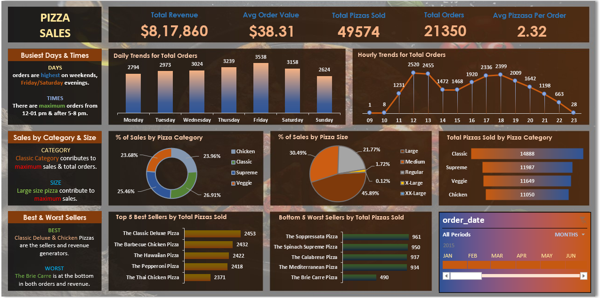

# Pizza-Sales-Analysis-SQL-Excel-Dashboard

## Description
This project analyses pizza sales data using SQL and Microsoft Excel to uncover revenue trends, customer ordering patterns, and product performance. SQL was used to calculate key performance indicators (KPIs) and answer business questions, while Excel was used to build an interactive dashboard for data visualization and reporting.

## Dashboard Snapshot

## Tools Used
- SQL (MySQL)
- Microsoft Excel
- Pivot Tables
- Pivot Charts
- Slicers
- Dashboard Design

  ## Project Objectives
- Analyze overall sales performance and revenue trends
- Measure customer ordering behavior
- Identify best-selling and worst-selling pizzas
- Compare sales by category and size
- Build an interactive dashboard for business decision-making

  ## Business Questions Addressed
1. What is the total revenue generated?
2. What is the average order value?
3. How many pizzas were sold?
4. How many total orders were placed?
5. What is the average number of pizzas per order?
6. Which days of the week have the highest number of orders?
7. What are the busiest hours of the day?
8. What percentage of sales comes from each pizza category?
9. What percentage of sales comes from each pizza size?
10. Which pizza categories sell the most units?
11. What are the top 5 best-selling pizzas?
12. What are the bottom 5 worst-selling pizzas?

## Key Insights
- Total revenue exceeded $817K.
- More than 49,000 pizzas were sold across over 21,000 orders.
- The average order value was approximately $38.
- Customers ordered an average of 2.3 pizzas per order.
- Orders peaked on weekends, especially Friday and Saturday.
- Lunch and evening hours are the busiest ordering periods.
- Large pizzas contributed the highest share of revenue.
- Classic pizzas generated the largest portion of total sales.
- The Classic Deluxe & Chicken pizzas are among the top-selling products.
- The Brie Carre Pizza is one of the lowest-selling products.

 ## Conclusion and Recommendations
The analysis shows strong sales concentration during peak meal hours and weekends. Large pizzas and Classic category products are the biggest revenue drivers. The business should focus promotions during high-demand periods, maintain inventory for top-selling pizzas, and review low-performing items for possible repositioning or removal.

## Files Included
- Pizza_sales_sql_queries.docx
- Pizza_Sales_Dashboard.xlsx
- dashboard.png
- README.md

## Download Project Files
- [Download Excel Dashboard](Pizza_Sales_Dashboard.xlsx)
- [Download SQL Queries](Pizza_sales_sql_queries.docx)
